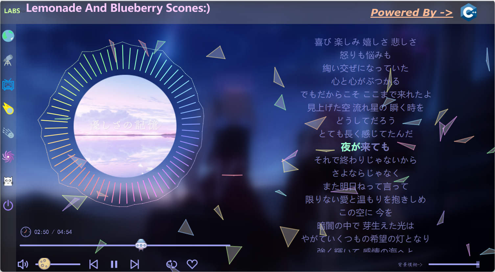
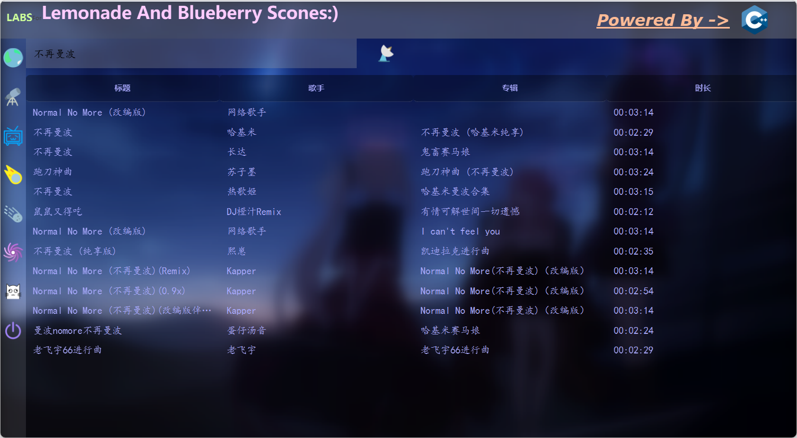
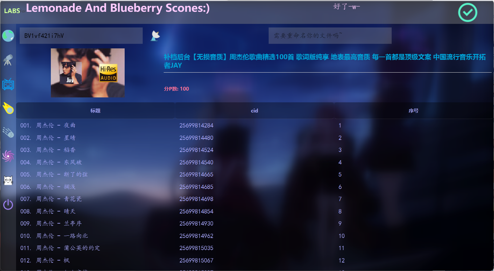

# 🎶 LABS

LABS 是一个基于 **Qt 6.8 + C++** 开发的音乐播放器。
LABS 提供:
- 本地/网络音乐播放
- 滚动歌词显示
- 简单的歌单管理
- 音频可视化
- 自定义的背景/主题/qss
本项目主要作为学习 Qt 与 C++ 的实践(同时方便我自己在bilibili听歌😋)  

---

## ✨ 功能特性

- ✅ 本地音乐文件播放
- ✅ 歌词解析与同步显示
- ✅ 频谱可视化
- ✅ 自定义主题 / 皮肤
- ✅ 网络音乐信息获取（BiliBili / kugou网页api）
- 🚧 [TODO] 播放列表管理  
- 🚧 [TODO] 音效
- 🚧 [TODO] ???

---

## 📸 界面预览





---

## 📦️ 快速开始
- windows: 下载release后运行'LABS.exe'即可
- MacOS/Linux: sooooory 项目目前可能还不支持😭

---

## 🛠️ 构建方法

### 环境要求
- windows 11(更低或许也行)
- CMake >= 3.16(更低或许也行)
- C++17
- Qt 6.8 (Widgets, Multimedia, Core5Compat, Network 模块)
- 依赖库：
  - [TagLib](https://taglib.org/)  
  - [FFTW3](http://www.fftw.org/)  
  - [FFmpeg](https://ffmpeg.org/)
- 推荐使用Qt Creator导入项目后构建
- 构建完成后应用需要下面的文件来支持运行：
  - 'bin' 目录下的dll及exe
  - 'qss' 目录(用于存放样式表)
  - 'themes' 目录(用于存放主题)

---

## 📂 项目结构

```bash
LABS/
├─ CMakeLists.txt
├─ src   # 源代码
│  ├─ main.cpp
│  ├─ widget.h / widget.cpp / widget.ui
│  ...
├─ include/   # 依赖库
│  ├─ ffmpeg/
│  ├─ fftw/
│  └─ taglib/
├─ bin/
│  ├─ 动态链接库
│  ...
├─ resources/
│  ├─ source/
│  ├─ .qrc
│  ...
└─ screenshots/   # 界面截图（仅用于展示）
```

---

## 📜 开源许可证

本项目使用 [MIT License](LICENSE)。
你可以自由使用、修改和分发本项目，但请保留版权声明。

---

## 🙌 致谢

* [Qt](https://www.qt.io/)
* [FFmpeg](https://ffmpeg.org/)
* [TagLib](https://taglib.org/)
* [FFTW3](http://www.fftw.org/)

---

## 🚀 End

本项目是我在学习 C++ 与 Qt 过程中的实践。
如果你觉得项目有帮助，欢迎给个 ⭐ Star 支持一下！
欢迎提出建议和反馈！
